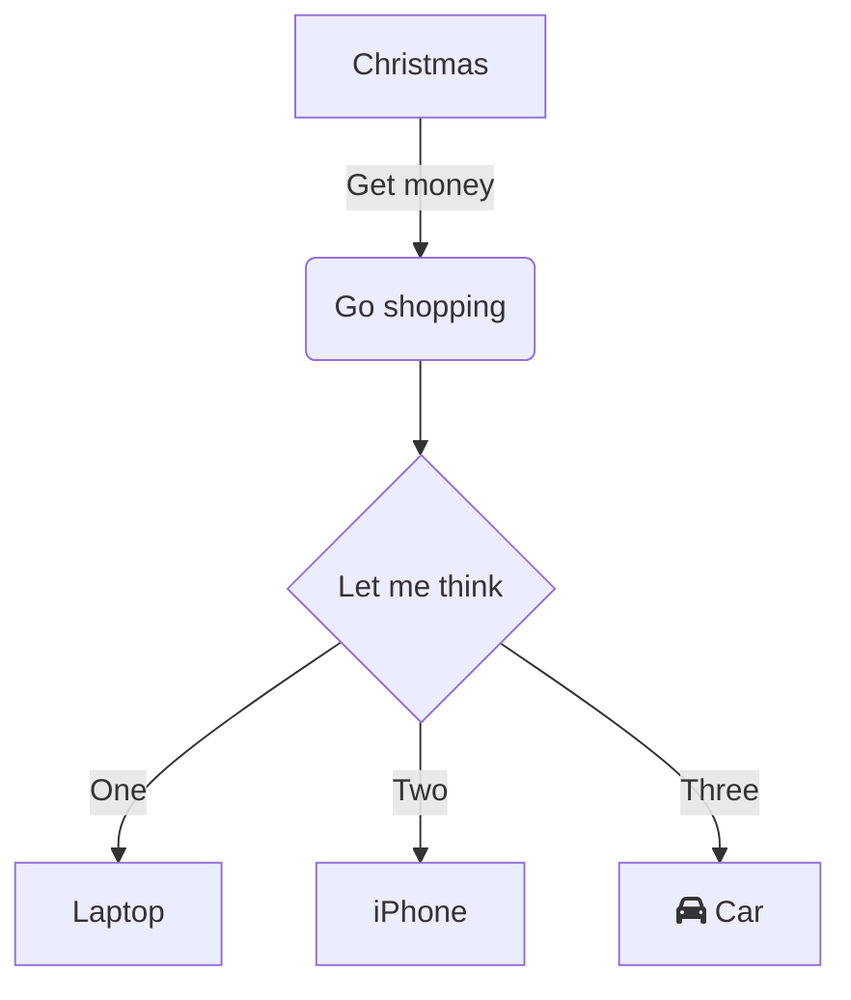
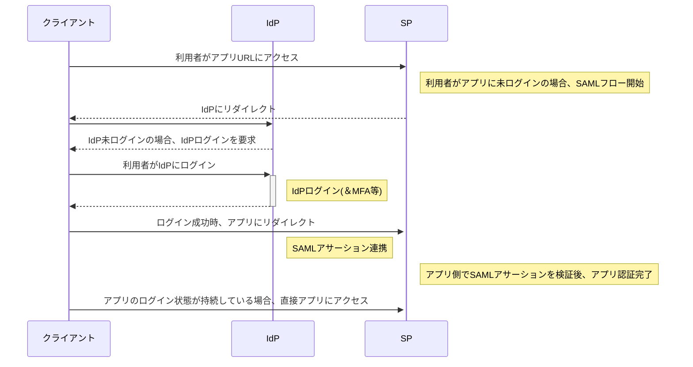

---
tags:
  - obsidian
  - Markdown
---
# マークダウン記法およびデザイン確認ページ
---
各記法は、`\`でエスケープ。パス等の空白は、URLエンコーディング`%20`でエスケープ。
線は`---`

### タグ
---
\#でスペース入れずに記入。
#obsidian #Markdown

### 見出し
---
# h1
## h2
### h3
#### h4
##### h5
###### h6


### リスト
---
- リスト1
    - リスト1-1
        - リスト1-1-1
    - リスト1－2
- リスト2

1. 番号付きリスト1
    1. 番号付きリスト1-1
2. 番号付きリスト2

### チェックボックス
---
- [ ] チェックボックス
- [x] 完了

### 引用
---
> 引用
>> 引用2
>>> 引用3

### コード
---
1行コード：`print 'hoge'`
コマンドライン風：\> curl inet-ip.info
複数行コード：
⇒ バッククオート3連の後に、言語(下の例では、java)を指定
```java:test.java
class Main {
  public static void main(String[] args) {
    String msg = "Hello World!";
    System.out.println(msg);
  }
}
```
[Markdown記載のサポート言語一覧](https://prismjs.com/#supported-languages)

### 文字を特徴付ける
---
太字　　　　　　 ：**太字**
イタリック　 　　　：*Italic*
太字＆イタリック：***太字Italic***
取り消し線　　　：~~取り消し~~
ハイライト　　　　：==ハイライト==

### 脚注
---
シンプルな脚注[^1] と長い脚注。[^bignote]
[^1]: シンプル
[^bignote]: 長文の脚注を書く。 

### コールアウト
---
\>[!注意]
\>バッククォートでこのように書くことでコールアウト可能。
> [!注意]
> バッククォートでこのように書くことでコールアウト可能。
> [[home]] 内部リンク埋め込みも可能。

＝＞ 詳細はこちら　[[obsidian_コールアウト一覧]]

### リンク (一部Obsidian固有)
---
URL　　　　　　 ：[QiitaのObsidian記事一覧](https://qiita.com/tags/obsidian)
未リンクのページ：[[リンクしていない]]
リンク済のページ：[[home]]
ブロック単位で埋め込み可能　：`![[obsidian_設定その他#Dataviewまとめ]]`
![[obsidian_Tips#Dataviewまとめ]]


### 画像埋め込み
---
vault内の画像やpdfを埋め込み（幅300pixel）
`![[obsidian_logo.png|300]]` 画像名|横、もしくは画像名|横×縦
![[obsidian_logo.png|300]]

web上の画像を埋め込み（幅100pixel）
``


### 数式
---
`$$e^{i\pi} = -1$$`のように記載する。 
$$e^{i\pi} = -1$$
$$\begin{vmatrix}a & b\\
c & d
\end{vmatrix}=ad-bc$$
Obsidianは、[Mathjax](https://docs.mathjax.org/en/latest/basic/mathjax.html)を使用している。対応している[記法リスト](https://docs.mathjax.org/en/latest/input/tex/extensions/index.html)。

### table
---
表を書くときは、前後一行を空ける。

| 抵抗  | R1  | R2  | R3  | R5  | R4  |
| --- | --- | :-: | --- | --- | --- |
| Ω   | 500 | 100 | 619 | 250 | 300 |
| V   |     |     |     |     |     |
| A   |     |     |     |     |     |


### ダイアグラム
---
[[Mermaid記法]]に対応している。
\`\`\`mermaid
sequenceDiagram
～内容を書く～
\`\`\`




### 絵文字
---
- [[マークダウン絵文字まとめ]]
- 